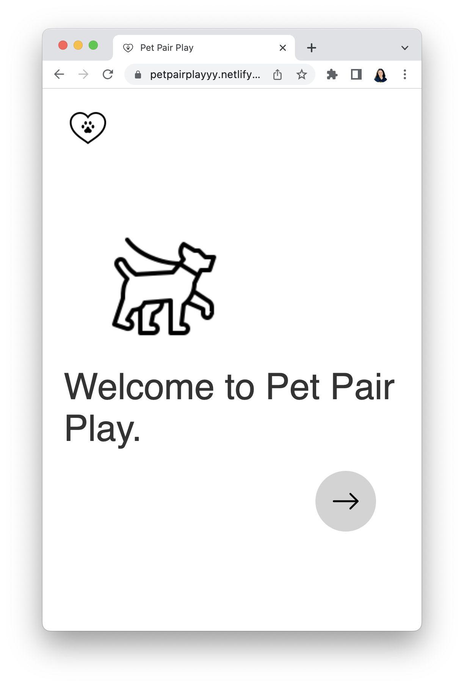
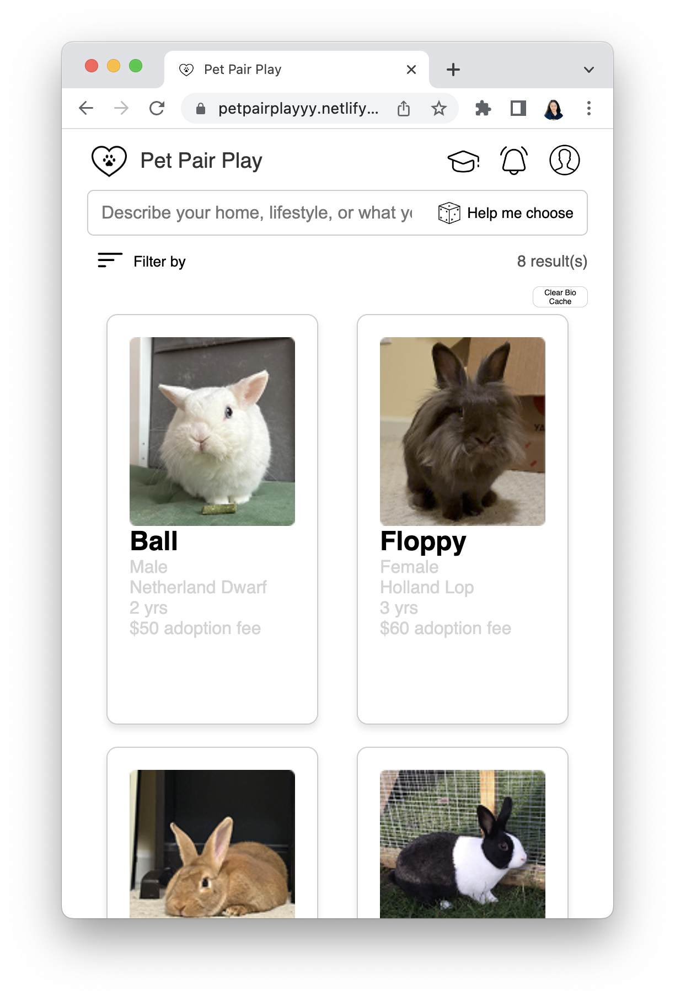
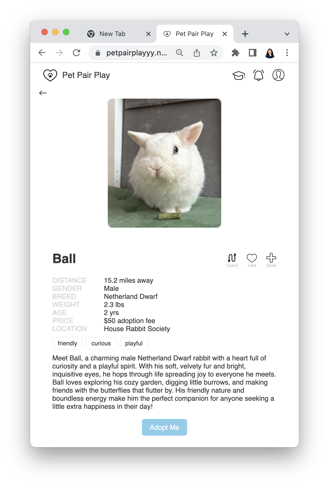
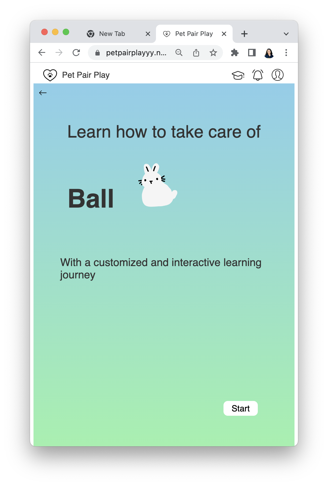
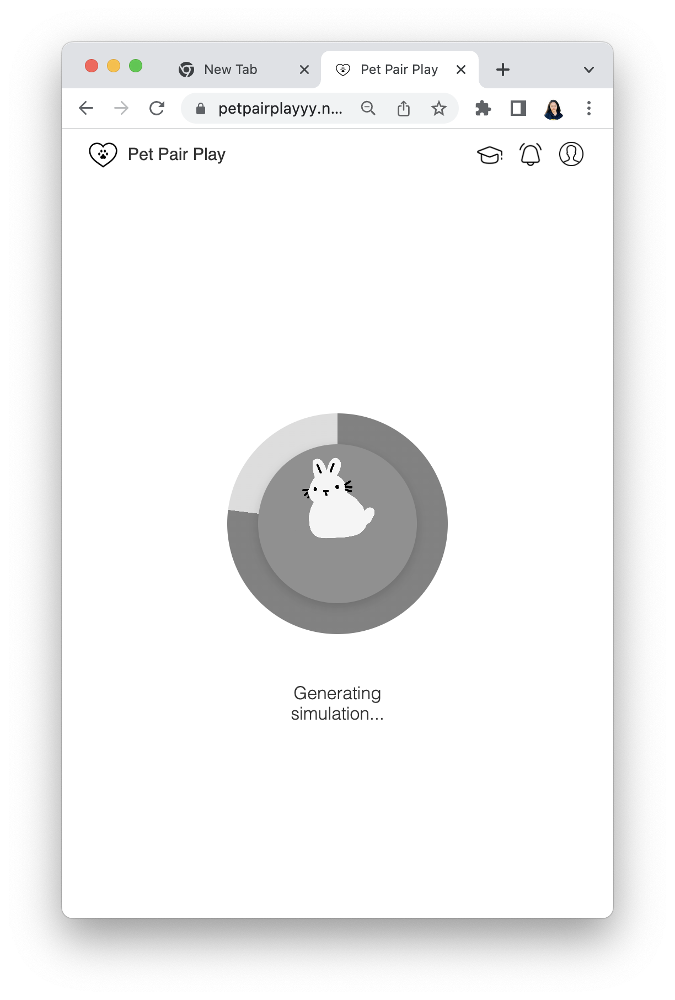
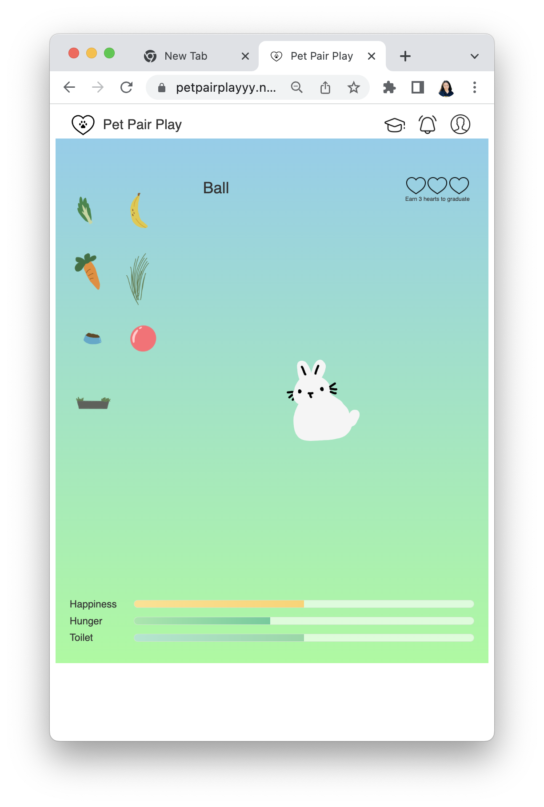
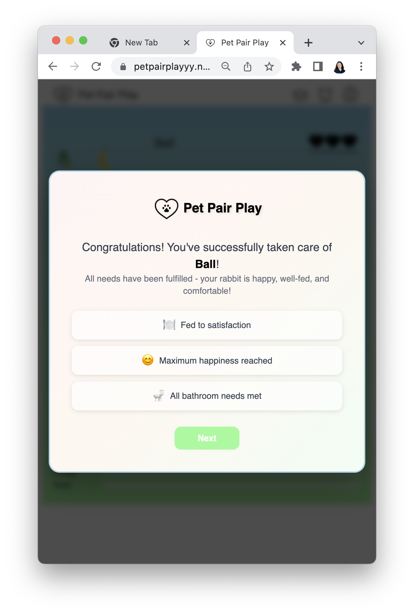
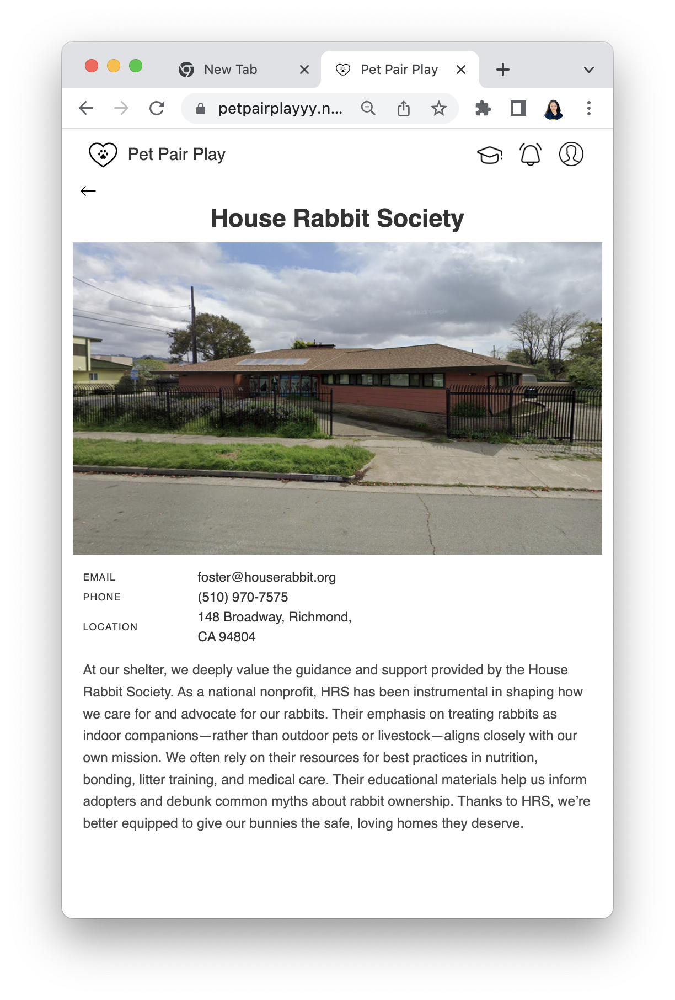

# PetPairPlay

## Try it out at: https://petpairplay.netlify.app/

## Overview
PetPairPlay is a **frontend React web application** built with **Vite**. It allows users to browse adoptable rabbits, filter by preferences, read educational articles, view shelter information, and try a simple pet simulation.

---

## Repository Structure
- `index.html`                 — Vite entry HTML
- `package.json`               — npm scripts and dependencies
- `vite.config.js`             — Vite configuration
- `src/`                       — React source code
  - `main.jsx`, `App.jsx`, `App.css`, `index.css`
  - `rabbits.json`             — data used by the app
  - `components/`              — UI components
    - `rabbitDisplay/`         — cards / details for rabbits
    - `filter/`                — filter modal & logic
    - `petSimulation/`         — simple simulation feature
    - `article/`               — educational pages
    - `shelter/`               — shelter info
    - `welcomePage/`, `userProfile/`, etc.
- `public/`                    — static assets (if any)
- `dist/`                      — production build output (if already built)

---

## Prerequisites
- **Node.js ≥ 18** 
- **npm ≥ 9** 

Check your versions:
```
node -v
npm -v
```

---

## Install Dependencies
From the project root (folder containing `package.json`):
```
npm install
```

## Run in Development
Start Vite’s dev server (hot-reload):
```
npm run dev
```
By default Vite prints a local URL, typically:
```
http://localhost:5173
```
Open that URL in your browser.

### If you see “Permission denied” running Vite on macOS:
This can happen if the vite binary in `node_modules/.bin` lost its executable flag.
Use the following command:

```
rm -rf node_modules
npm install
npm run dev

```
<br>

# Instruction for using app
## 1. Welcome Page
After you open the app, there will be a welcome page.<br>
Click the right arrow button to the main pages.<br>

<br>

## 2. Main Page

<br>

### 2.1 Browse Available Rabbits
The homepage displays a grid of adoptable rabbits, each shown in a card format with:
- **Photo**
- **Name**
- **Gender**
- **Breed**
- **Age**
- **Adoption fee**

### 2.2 Search for Your Match
- Use the search bar at the top to describe your preferences for the pet.
- Click the **"Help me choose"** button for guided suggestions.
- For example you can type: "I want a kind cute outgoing bunny", and then click help me choose, then the AI will match a bunny that corresponding to your preference.

### 2.3 Filter Results
- Click **"Filter by"** to narrow down results based on attributes like age, breed, or adoption fee.

### 2.4 View Rabbit Details
- Click a rabbit’s card to see its full profile and biography.  
- Use **"Clear Bio Cache"** to reset stored biographies if updated data is available.

### 2.5 See Total Matches
- The app displays the total number of results (e.g., “8 result(s)”) so you know how many rabbits fit your criteria.

## 3. Individual Profile Page
When you click on a rabbit card from the main page, you will be taken to the **Individual Profile Page**.
<br>


On this page, you can view detailed information about the selected rabbit, including:
- **Photo**
- **Distance** from your location
- **Gender**
- **Breed**
- **Weight**
- **Age**
- **Adoption fee**
- **Location** (shelter name)
- **Personality tags** (e.g., friendly, curious, playful)
- **Full biography** generated by AI to describing the rabbit’s personality and habits

You can also:
- Click **Learn**, it will redirect to the pet simulation page. [See section 4]
- Click **Save** icons, the main page will have **saved rabbit** button which after you click that button, it will show the rabbit you saved.
- Press the **"Adopt Me"** button, it will redirect to the corresponding shelter page with the information about the shelter. [See section 5]

## 4. Pet Simulation Page
After you click learn button in the individual profile page, it will redirect to the **Pet Simulation Page**, which lets you interact with your chosen rabbit in a virtual environment.  
<br>
<p float="left">
  
  
  
</p>

**Features:**
- **Interactive Items**: Drag and drop food (carrot, banana, veggies, pellets) or toys to your rabbit.
- **Happiness, Hunger, and Toilet Bars**:  
  - **Happiness**: Increases when you play with the rabbit.
  - **Hunger**: Decreases when you feed your rabbit.
  - **Toilet**: Decreases when rabbit need toilet.
- **Hearts Progress**: Earn hearts by keeping your rabbit happy and healthy.  
  - When you reach 3 hearts, you “graduates” from the simulation.
**AI Integration**: The bunny can “chat” with you, giving preferences or needs (e.g., *"I don't like banana"*, *"I want toilet"*). 
<p>
 </p>
After you click the **next button**, it will redirect to the main page.

## 5. Shelter Information Page
The **Shelter Information Page** provides detailed contact information and background about the shelter where the rabbit is located.  
<br>


**Details Displayed:**
- **Email**: Shelter’s contact email for inquiries
- **Phone**: Direct contact number
- **Location**: Full address of the shelter
- **Photo of the Shelter**: A visual of the facility
- **Description**: A written overview of the shelter’s mission, values, and care practices

This page helps potential adopters:
- Learn more about the shelter’s approach to rabbit care
- Understand their adoption philosophy
- Get in touch with the shelter directly for adoption or volunteering